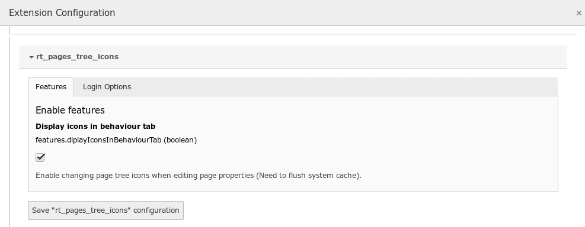
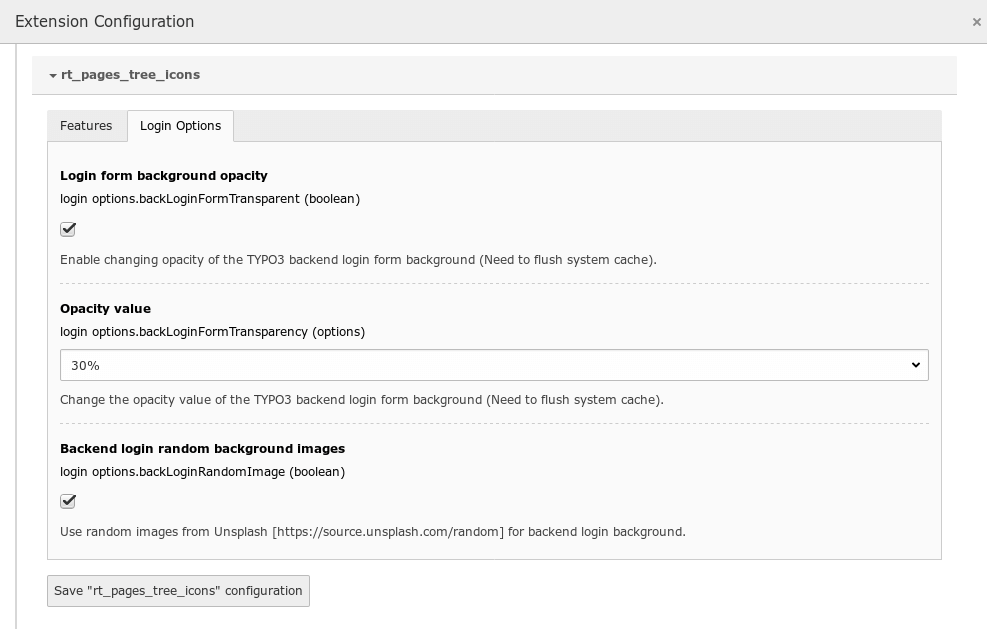
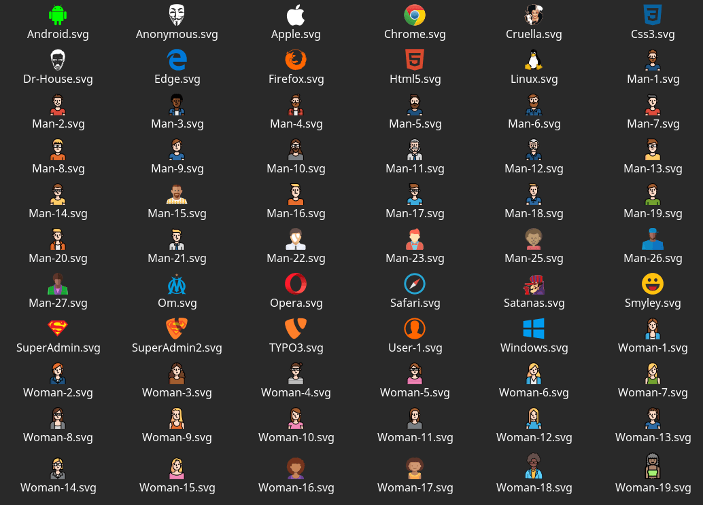

.. ==================================================
.. FOR YOUR INFORMATION
.. --------------------------------------------------
.. -*- coding: utf-8 -*- with BOM.

.. include:: ../Includes.txt

.. _admin-manual:

Administrator Manual
====================

Target group: **Administrators**

You can adust backend login interface appearance by configuring the global extension.

    - In TYPO3 V7 or V8 : Admin Tools > Extensions Manager > Pages Tree Icons (rt_pages_tree_icons) > Cog configuration icon.
    - In TYPO3 V9 : Admin Tools > Settings module > Configure extension > rt_pages_tree_icons.

Here, you can :

    - Enable changing page tree icons when editing page properties (Need to flush system cache),
    - Enable changing opacity of the TYPO3 backend login form background (Need to flush system cache),
    - Change the opacity value of the TYPO3 backend login form background (Need to flush system cache),
    - Use random images from Unsplash [https://source.unsplash.com/random] for backend login background.

   Enabling changing page tree icons when editing page properties.

   Configuring backend login interface.

The extension also provides a set of avatars icons for backend users accounts.

During extension installation, Avatars icons are copied in /fileadmin/rt_pages_tree_icons/avatars.

.. figure:: ../Images/fileadmin.png
   :width: 761px
   :alt: Avatars