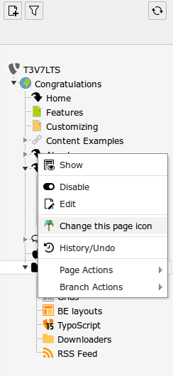

.. ==================================================
.. FOR YOUR INFORMATION
.. --------------------------------------------------
.. -*- coding: utf-8 -*- with BOM.

.. include:: ../Includes.txt

.. _introduction:

Introduction
============

.. _what-it-does:

What does it do?
----------------

This extension gives you the ability to change the TYPO3 pages tree icons 

.. important::

   This extension only works with TYPO3 from V7.6.X to V8.5.X

.. _screenshots:

Screenshots
-----------

This extension provides a new web module to change SVG icon per page.

.. figure:: ../Images/rtpim.png
   :width: 990px
   :alt: Page icon changer web module

   Page icon changer web module in action.

   You can change page icon in a few clicks.

This new web module is also accessible via the Pages treeview contextual menu.

       Page icon changer web module access from contextual menu.