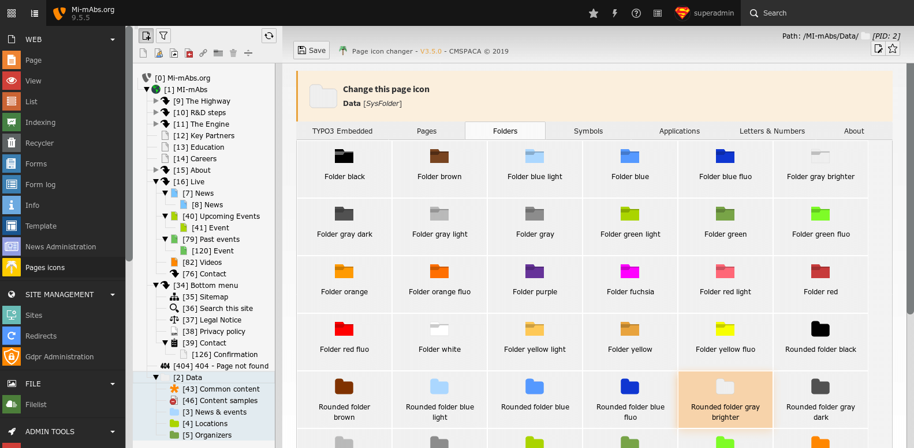
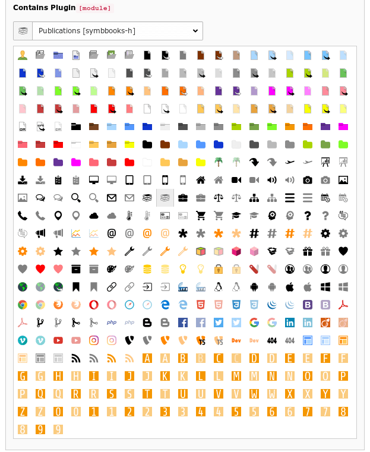
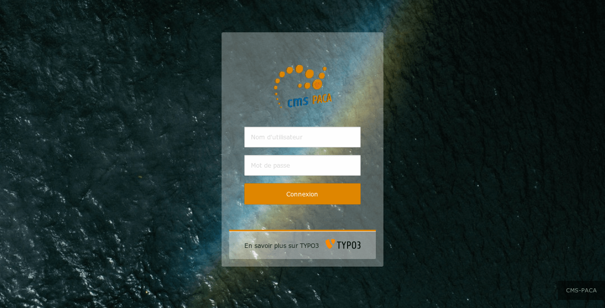

.. ==================================================
.. FOR YOUR INFORMATION
.. --------------------------------------------------
.. -*- coding: utf-8 -*- with BOM.

.. include:: ../Includes.txt

.. _introduction:

Introduction
============

.. _what-it-does:

What does it do?
----------------

This extension gives you the ability to change the TYPO3 pages tree icons.
A new Backend-Module to have a more comprehensive page treeview.
You can now dress TYPO3 page treeview with custom SVG icons.

.. important::

    - This extension works from TYPO3 V7.6.0 to V9.5.99
    - This extension is provided with French, English, German, Italian and Spanish translations.

.. _screenshots:

Screenshots
-----------

This extension provides a new web module to change SVG icon per page.

Page icon changer web module in action.
You can change page icon in a few clicks.

Behavior Tab when editing page properties.

The extension give the ability to modify the backend login appearance.

Uses Unsplash random images for backend login form background.