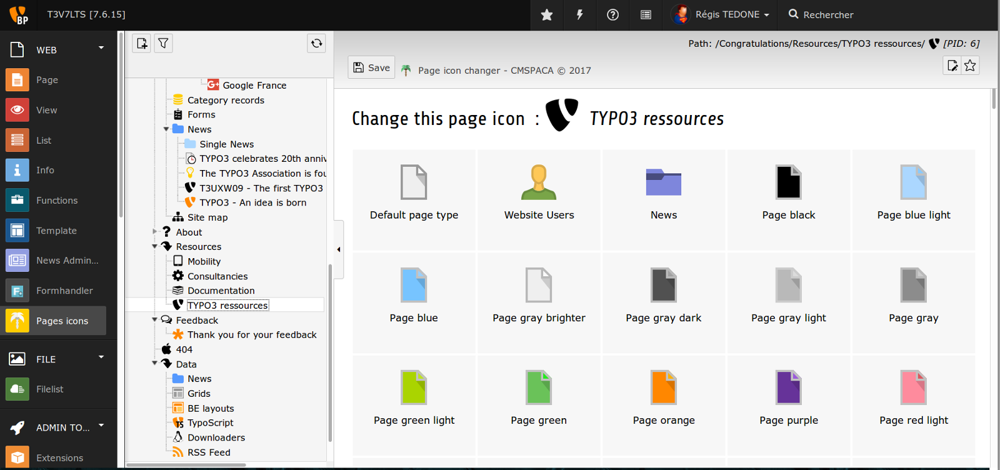
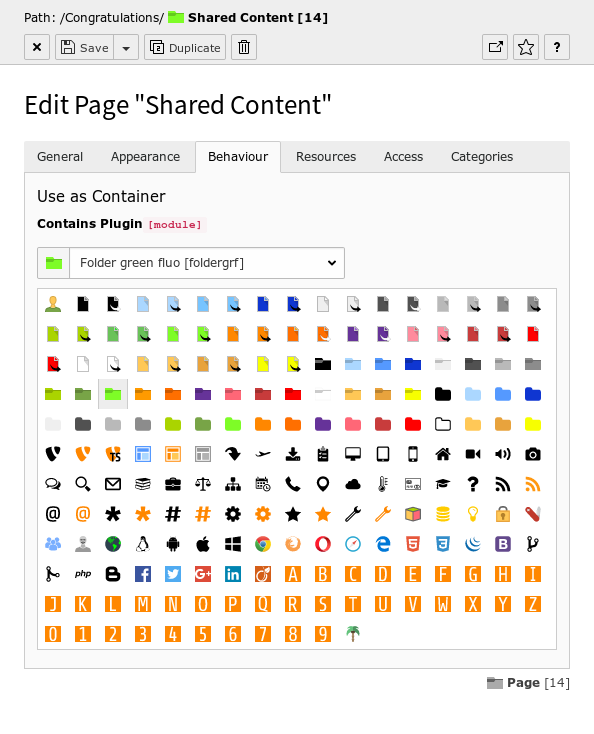
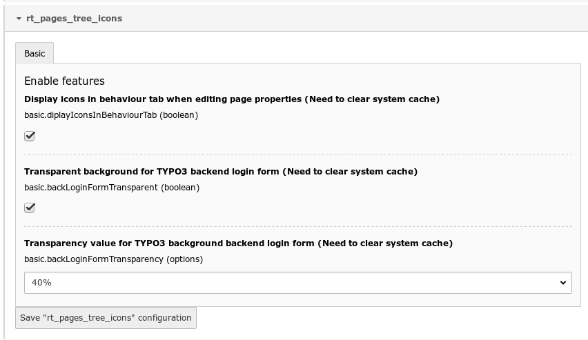
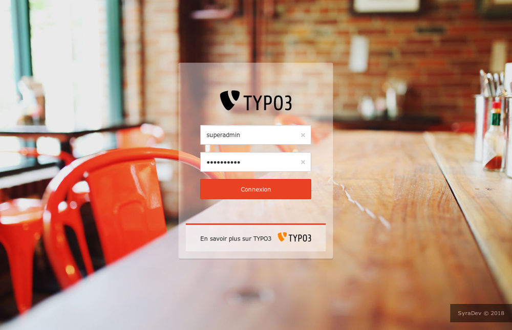

.. include:: ../Includes.txt

.. _introduction:

Sceenshots
============

.. _what-it-does:

What does it do?
----------------

This extension gives you the ability to change the TYPO3 pages tree icons

.. important::

   This extension only works with TYPO3 from V7.6.X to V9.2.X

.. _screenshots:

Screenshots
-----------

This extension provides a new web module to change SVG icon per page.

Page icon changer web module in action.
You can change page icon in a few clicks.

Behavior Tab when editing page properties.

This extension give the ability to change the background backend login transprency.

